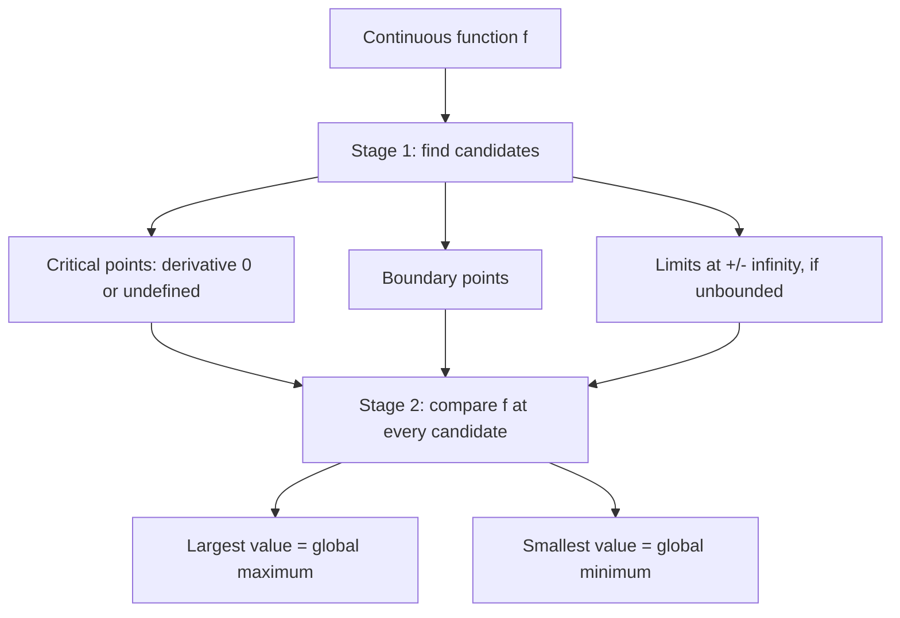
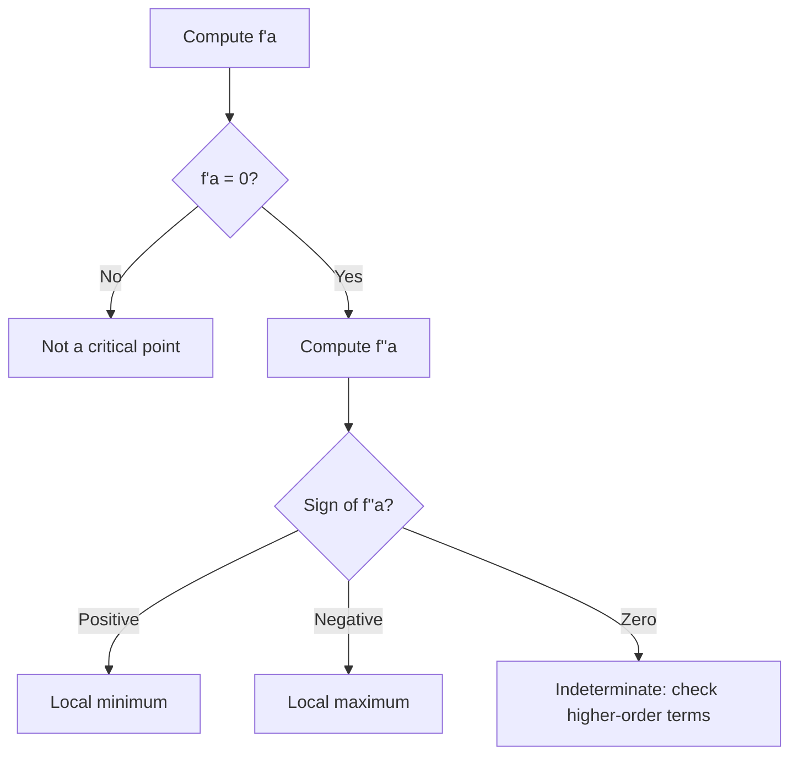

# Critical Points and the Second Derivative Test

## Concept

### Optimization Overview

Given a continuous function, "optimizing" it means finding its
global maximum, global minimum, local maxima, local minima, and any
saddle points. That search always happens in two stages. **Stage
1** collects every *candidate* point: places where the function
could plausibly peak or bottom out — critical points (where the
derivative is zero or undefined), boundary points, and, if the
domain is unbounded, the behavior as the input runs off to
`+infinity` or `-infinity`. **Stage 2** compares the function's
value at every candidate: the largest value found is the global
maximum, the smallest is the global minimum.



This session zooms into the first stage's most interesting
candidates — critical points — and builds the tool that classifies
each one as a minimum, a maximum, or (once there's more than one
input) a saddle: the **second-derivative test**.

### Single Variable

For a function `f: R -> R`, a critical point occurs where

```
f'(a) = 0
```

(or where `f'(a)` doesn't exist). Geometrically, the tangent line
goes flat right there:

```
      ^
      |
      |      •
      |    /
------•------------------>
```

A critical point is only a *candidate* minimum or maximum — nothing
so far says which, or whether it's neither. To decide, look at how
`f` behaves in a small neighborhood around `a`. The **Taylor
expansion** describes exactly that: nudging `a` by a small step `h`,

```
f(a+h) - f(a) = f'(a)h + (1/2) f''(a) h^2 + ...
```

Read the two terms as two separate physical effects. The
first-order term, `f'(a)h`, says

```
change in f = slope x distance moved
```

— the same shape as `distance = speed x time`. The second-order
term captures something the first-order term misses: the slope
itself doesn't stay put as you move, it drifts at rate `f''(a)`.
Since that drift is approximately linear over a short step, the
*extra* contribution to the change in `f` is the area of a thin
triangle whose base is `h` and whose height is how much the slope
drifted, `f''(a)h`:

```
Slope

|
|      /
|     /
|____/_________

       h
```

```
area = (1/2)(base)(height) = (1/2) h (f''(a) h) = (1/2) f''(a) h^2
```

That's where the otherwise-mysterious `1/2` comes from — it's a
triangle's area formula (equivalently, the average slope over the
interval, since the slope ramps linearly from `f'(a)` to
`f'(a) + f''(a)h`).

**The second-derivative test.** At a critical point, `f'(a) = 0`,
so the Taylor expansion collapses to

```
f(a+h) - f(a) ~= (1/2) f''(a) h^2
```

Since `h^2 > 0` for every nonzero `h`, the sign of this change is
decided entirely by `f''(a)`:

* **`f''(a) > 0`** — every nearby `h` makes `f` larger, so `a` sits
  at the bottom of a bowl: a **local minimum**.

  ```
        •
      /   \
  ```

* **`f''(a) < 0`** — every nearby `h` makes `f` smaller, so `a`
  sits at the top of a dome: a **local maximum**.

  ```
     \     /
       •
  ```

* **`f''(a) = 0`** — the Taylor expansion's leading term vanishes
  too, so it gives no information; higher-order terms decide the
  outcome. For example, `f(x) = x^4` has `f''(0) = 0`, yet `x = 0`
  is still a minimum — the test is **indeterminate** here, not
  wrong.


