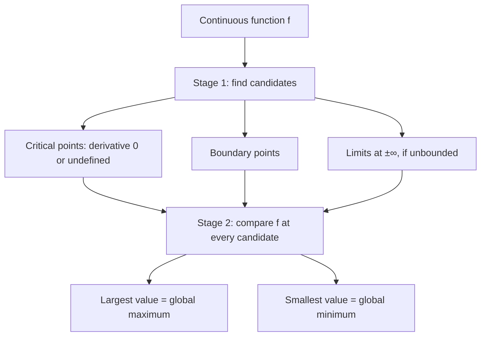
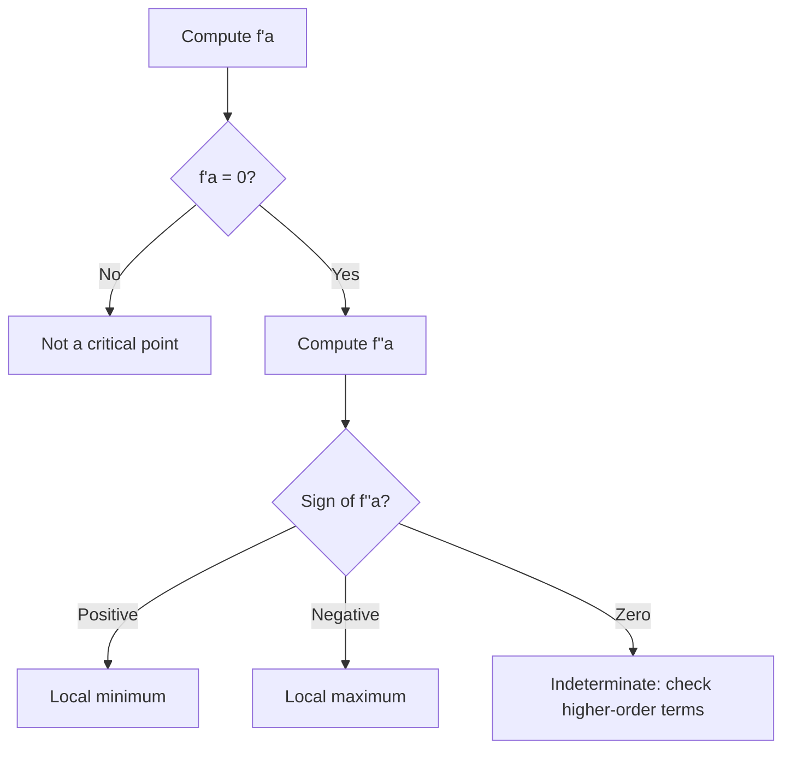
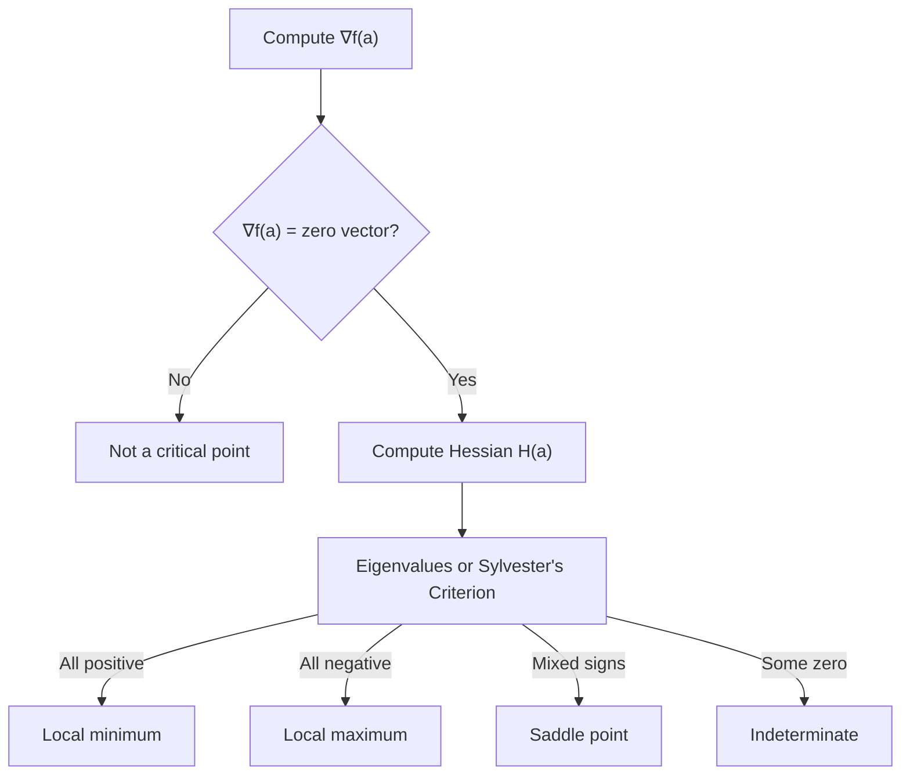

# Critical Points and the Second Derivative Test

## Concept

### Optimization Overview

Given a continuous function, "optimizing" it means finding its
global maximum, global minimum, local maxima, local minima, and any
saddle points. That search always happens in two stages. **Stage
1** collects every *candidate* point: places where the function
could plausibly peak or bottom out — critical points (where the
derivative is zero or undefined), boundary points, and, if the
domain is unbounded, the behavior as the input runs off to
`+∞` or `-∞`. **Stage 2** compares the function's
value at every candidate: the largest value found is the global
maximum, the smallest is the global minimum.



This session zooms into the first stage's most interesting
candidates — critical points — and builds the tool that classifies
each one as a minimum, a maximum, or (once there's more than one
input) a saddle: the **second-derivative test**.

### Single Variable

For a function `f: R -> R`, a critical point occurs where

```
f'(a) = 0
```

(or where `f'(a)` doesn't exist). Geometrically, the tangent line
goes flat right there:

```
      ^
      |
      |      •
      |    /
------•------------------>
```

A critical point is only a *candidate* minimum or maximum — nothing
so far says which, or whether it's neither. To decide, look at how
`f` behaves in a small neighborhood around `a`. The **Taylor
expansion** describes exactly that: nudging `a` by a small step `h`,

```
f(a+h) - f(a) = f'(a)h + (1/2) f''(a) h^2 + ...
```

Read the two terms as two separate physical effects. The
first-order term, `f'(a)h`, says

```
change in f = slope x distance moved
```

— the same shape as `distance = speed x time`. The second-order
term captures something the first-order term misses: the slope
itself doesn't stay put as you move, it drifts at rate `f''(a)`.
Since that drift is approximately linear over a short step, the
*extra* contribution to the change in `f` is the area of a thin
triangle whose base is `h` and whose height is how much the slope
drifted, `f''(a)h`:

```
Slope

|
|      /
|     /
|____/_________

       h
```

```
area = (1/2)(base)(height) = (1/2) h (f''(a) h) = (1/2) f''(a) h^2
```

That's where the otherwise-mysterious `1/2` comes from — it's a
triangle's area formula (equivalently, the average slope over the
interval, since the slope ramps linearly from `f'(a)` to
`f'(a) + f''(a)h`).

**The second-derivative test.** At a critical point, `f'(a) = 0`,
so the Taylor expansion collapses to

```
f(a+h) - f(a) ~= (1/2) f''(a) h^2
```

Since `h^2 > 0` for every nonzero `h`, the sign of this change is
decided entirely by `f''(a)`:

* **`f''(a) > 0`** — every nearby `h` makes `f` larger, so `a` sits
  at the bottom of a bowl: a **local minimum**.

  ```
        •
      /   \
  ```

* **`f''(a) < 0`** — every nearby `h` makes `f` smaller, so `a`
  sits at the top of a dome: a **local maximum**.

  ```
     \     /
       •
  ```

* **`f''(a) = 0`** — the Taylor expansion's leading term vanishes
  too, so it gives no information; higher-order terms decide the
  outcome. For example, `f(x) = x^4` has `f''(0) = 0`, yet `x = 0`
  is still a minimum — the test is **indeterminate** here, not
  wrong.



### Multivariable

For a function `f: R^n -> R`, the single derivative `f'` is
replaced by the **gradient**, the vector of every partial
derivative:

```
∇f(a) = [ ∂f/∂x_1, ∂f/∂x_2, ..., ∂f/∂x_n ]
```

(This is exactly the `∇f` from [Partial Derivatives and
Multivariate Calculus](
  partial_derivatives_multivariate_calculus.md
).) A critical point is a point `a` where the gradient is the zero
vector:

```
∇f(a) = 0
```

Taylor's expansion generalizes the same way. For a small
displacement vector `v`,

```
f(a+v) - f(a) = ∇f(a) . v + (1/2) vᵀ H(a) v + ...
```

where `H(a)` is the **Hessian** — the matrix of every second
partial derivative:

```
H(a) = [ ∂²f / (∂x_i∂x_j) ]
```

**Where the Hessian comes from.** Pick any unit direction `u` and
walk along the line `r(t) = a + t*u`. Define `g(t) = f(r(t))` — an
ordinary single-variable function tracking `f` along that one line.
Differentiating with the chain rule:

```
g'(0)  = ∇f(a) . u        (the directional derivative)
g''(0) = uᵀ H(a) u       (the second directional derivative)
```

So `uᵀ H u` measures **curvature**: how the slope along direction
`u` itself changes. This is the direct multivariable analog of
`f''(a)` — except now there's a different curvature value for every
direction `u`, and the Hessian is the single matrix that produces
all of them.

**Physical analogy.**

| Physics      | Calculus        |
| ------------ | ---------------- |
| Position     | Function value   |
| Velocity     | Gradient         |
| Acceleration | Hessian          |

At a critical point, velocity (the gradient) is zero, so — exactly
as in `s = s0 + v0*t + (1/2) a t^2` — acceleration (the Hessian)
alone determines what happens next.

**Positive/negative definite matrices.** A symmetric matrix `H` is:

* **Positive definite** if `xᵀ H x > 0` for every nonzero vector
  `x` — every direction curves upward, like a bowl:

  ```
        •
      /   \
  ```

* **Negative definite** if `xᵀ H x < 0` for every nonzero `x` —
  every direction curves downward, like a dome:

  ```
     \     /
       •
  ```

* **Indefinite** if `xᵀ H x` is positive for some `x` and negative
  for others — some directions curve up, some curve down:

  ```
       /
  ----•----
       \
  ```

  a **saddle**.

* **Semidefinite** if `xᵀ H x = 0` for some nonzero `x` — the test
  is inconclusive, just like `f''(a) = 0` in one variable.

**Why eigenvalues matter.** Hessians are real and symmetric, so the
Spectral Theorem guarantees real eigenvalues and orthogonal
eigenvectors. Writing any vector `x` in that eigenvector basis,
`x = c_1*v_1 + ... + c_n*v_n`, the quadratic form simplifies to

```
xᵀ H x = λ_1 c_1^2 + ... + λ_n c_n^2
```

Since every `c_i^2 >= 0`, the sign of `xᵀ H x` depends only on the
eigenvalues `λ_i`:

* all eigenvalues positive `<=>` positive definite `<=>` minimum
* all eigenvalues negative `<=>` negative definite `<=>` maximum
* mixed signs `<=>` indefinite `<=>` saddle point
* any eigenvalue zero `<=>` semidefinite `<=>` indeterminate

**Sylvester's Criterion.** Computing eigenvalues by hand is
tedious; Sylvester's Criterion classifies `H` from its **leading
principal minors** instead — the determinants `D_1, D_2, ..., D_n`
of the top-left `1x1`, `2x2`, ..., `nxn` blocks of `H`:

* **Positive definite:** every leading principal minor is
  positive — `D_1 > 0, D_2 > 0, ..., D_n > 0`.
* **Negative definite:** the signs alternate, starting negative —
  `D_1 < 0, D_2 > 0, D_3 < 0, ...`. (Each `D_k` equals, in the
  eigenvector basis, the product of the first `k` eigenvalues; if
  every eigenvalue is negative, one negative factor gives a
  negative product, two give a positive product, three give a
  negative product, and so on — hence the alternation.)

**The multivariable second-derivative test.** At a critical point,
`∇f(a) = 0`, so `f(a+v) - f(a) ~= (1/2) vᵀ H(a) v`, and:

| Hessian           | Result        |
| ------------------ | -------------- |
| Positive definite  | Local minimum |
| Negative definite  | Local maximum |
| Indefinite         | Saddle point  |
| Semidefinite       | Inconclusive  |



### Single Variable as n=1

Everything above reduces exactly to the single-variable case when
`n = 1`. The gradient becomes the ordinary derivative,
`∇f = f'`, and the Hessian becomes the ordinary second
derivative, `H = f''`. The quadratic form collapses to a single
term:

```
vᵀ H v = v * f'' * v = f'' * v^2
```

so the multivariable Taylor expansion,

```
f(a+v) - f(a) = ∇f(a) . v + (1/2) vᵀ H(a) v
```

becomes exactly the single-variable one,

```
f(a+h) - f(a) = f'(a)h + (1/2) f''(a) h^2
```

and positive/negative definiteness (`vᵀ H v > 0` or `< 0`)
collapses to `f'' > 0` or `f'' < 0`. The familiar
first-/second-derivative test from the Single Variable section
above isn't a separate idea — it's the Hessian test in its
simplest, one-dimensional form.

### Cheat Sheet

| Concept           | Single Variable      | Multivariable               |
| ------------------ | ---------------------- | ----------------------------- |
| First derivative   | `f'(x)`               | `∇f`                         |
| Critical point     | `f'(x) = 0`            | `∇f = 0`                     |
| Second derivative  | `f''(x)`               | Hessian `H`                  |
| Curvature          | `f''`                  | `vᵀ H v`                    |
| Local minimum      | `f'' > 0`              | `H` positive definite        |
| Local maximum      | `f'' < 0`              | `H` negative definite        |
| Saddle             | not applicable in 1D   | `H` indefinite               |
| Indeterminate      | `f'' = 0`               | `H` semidefinite or singular |

The unifying idea: optimization is fundamentally about local
curvature. In one dimension there's only one direction to move, so
a single number, `f''`, captures it. In many dimensions there are
infinitely many directions, so the Hessian acts as a "curvature
machine" — for any direction `u`, `uᵀ H u` returns the curvature
along that direction. Its eigenvectors are the principal directions
of curvature, and its eigenvalues measure how strongly the function
curves along each one.

## Reference

Watch these lectures from MIT's 18.02 *Multivariable Calculus*
(Fall 2007) [video gallery](
  https://ocw.mit.edu/courses/18-02-multivariable-calculus-fall-2007/video_galleries/video-lectures/
), the same series [Partial Derivatives and Multivariate
Calculus](partial_derivatives_multivariate_calculus.md) draws on —
these two are most directly about classifying critical points:

* **Lecture 9** — Max-Min and Least Squares
* **Lecture 10** — Second Derivative Test

## Exercise

Work through both exercises in [Critical Points](
  ../projects/critical_points/
) in a Jupyter or Colab notebook: first **Finding the Bowl's
Bottom** — finding and classifying every critical point of a
single-variable cubic by hand and numerically — then **Saddle or
Bowl?** — classifying multivariable critical points with the
Hessian, cross-checking eigenvalues against Sylvester's Criterion.
